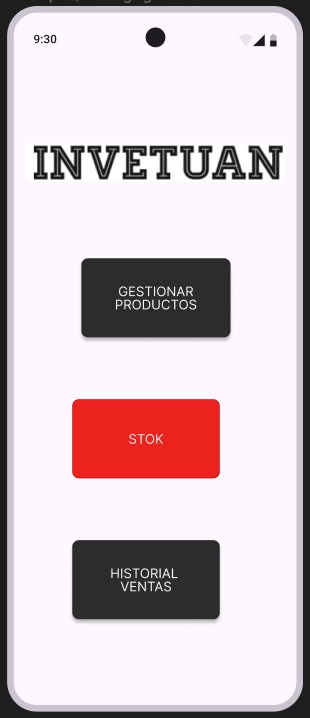

# Diseño de interfaz de usuario

La interfaz de usuario de la aplicación INVETUAN esta diseñada para un uso facil y directo para cualquier
tipo de usuario.

El diseño completoe esta disponible
en [Figma](https://www.figma.com/design/1Dtsl2vgyKPK9yatnmEmg0/INVENTUAN?node-id=0-1&t=8dGwlGEVP1JKmZIW-1)
. Los colores a usar estar[an basados en una combinación de escalas de blanco. A continuación se
presentan las principales pantallas:

1. Pagina principal

   Cuando el usuario ingrese a la aplicaicón verá una serie de botones los cuales guiaran al usuario a lo que desea.

   

2. Episodios de un Podcast

   Al seleccionar un Podcats, el usuario verá la lista de episodios de ese podcasts y podrá
   reproducirlos.

   

3. Búsqueda podcasts

   Adicionalmente el usuario podrá buscar los Podcasts de su interes usando palabras clave.

   
