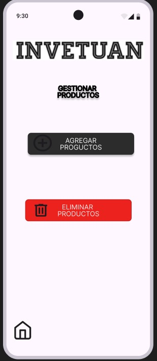
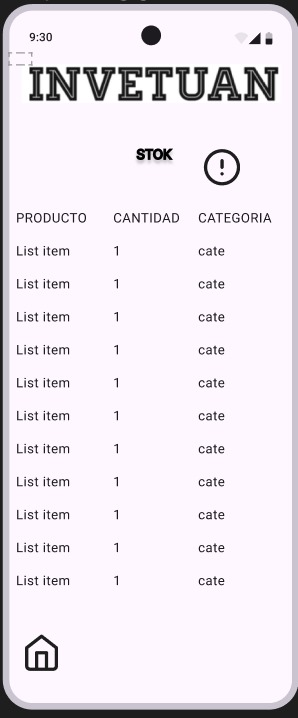

# Diseño de interfaz de usuario

La interfaz de usuario de la aplicación INVETUAN esta diseñada para un uso facil y directo para cualquier
tipo de usuario.

El diseño completoe esta disponible
en [Figma](https://www.figma.com/design/1Dtsl2vgyKPK9yatnmEmg0/INVENTUAN?node-id=0-1&t=8dGwlGEVP1JKmZIW-1)
. Los colores a usar estar[an basados en una combinación de escalas de blanco. A continuación se
presentan las principales pantallas:

1. Pagina principal

   Cuando el usuario ingrese a la aplicaicón verá una serie de botones los cuales guiaran al usuario a lo que desea.

   

2. Gestionar productos

   En esta pagina se hace la actualizacion del inventario, se pueden agregar y eliminar productos ya agregados.

   

3. Stok

   Muestra la lista de productos, cantidad y categoria y un icono de alerta en el que al momento de que aparezca la alerta dira
   que producto esta por acabarse.

   

4. Historial de ventas
   ESTO SE CONECTARA CON UNA TIENDA, LA CUAL NOS BRINDARA ESA INFORMACION.
   Muestra la lista de ventas en el cual aparece fecha, cliente, productos y el valor de la compra.

   
